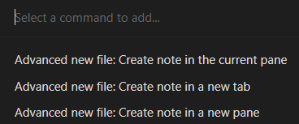
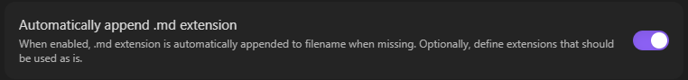
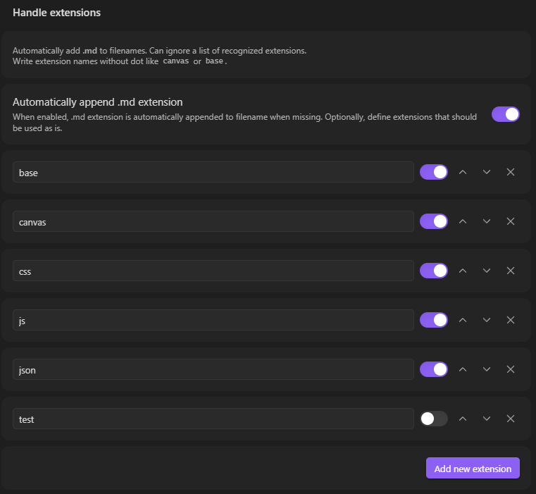

> You are looking at a fork of [vanadium23/obsidian-advanced-new-file](https://github.com/vanadium23/obsidian-advanced-new-file)
> - The upstream [Release 1.6.0](https://github.com/vanadium23/obsidian-advanced-new-file/releases/tag/1.6.0) _Jun 6, 2025_ introduced a generic approach treating any text in a note name following a dot as extension.
> - The idea of supporting all kinds of extensions is great, but the false positives are way to high for daily use.
> - Example: Adding a note like "Sample.Guide.How to break my new file" results in a file with ".How to break my new file" extension.

> This fork includes [PR #39](https://github.com/vanadium23/obsidian-advanced-new-file/pull/39) released as version [1.6.1](https://github.com/codeshell/obsidian-advanced-new-file/releases/tag/1.6.1)
> - Change: It changes the new feature into an allowlist of recognized extensions, with a sensible default, freely customizable by the user via settings.
> - Install it via BRAT (recommended) or manually

## Obsidian Advanced New File

<!--  -->

Obsidian Advanced New file is a plugin for [Obsidian](https://obsidian.md/), that provide functionality to choose folder over note creation.
The new note file is created with `Untitled.md` filename just to provide same behavior as default Obsidian.

The plugin is heavily inspired by [Note refactor](https://github.com/lynchjames/note-refactor-obsidian) and [similar extension](https://marketplace.visualstudio.com/items?itemName=dkundel.vscode-new-file) for Vs Code.

## Features

> [!TIP]
> you can set command `advanced new file` to shortcut like `Ctrl/Cmd` + `Alt` + `N`.

Spawn command `advanced new file` and choose directory. Then you can type full path to file.

### Default File Extension

If no extension is provided, it defaults to `.md`, following the Obsidian convention.

- Example: Adding a "Test" note creates a "Test.md" file.
- Example: Adding a "Test.js" note creates a "Test.js.md" file. _unless allowed as custom extension (below)_

> [!NOTE]
> Most of the time you won't see the default extension because Obsidian hides it from the user / GUI.

> [!IMPORTANT]
> If you have a special use case where you want to create all files with the exact name you entered, the default extension can be disabled via settings.
> Please double check, if this is really intended.

- Example: The note "Test" is created as "Test" on the filesystem (e.g. no extension, not recogized by Obsidian as markdown file / note)
- Example: The note "Test 1.0 for instance" is created as "Test 1" with extension ".0 for instance" on the filesystem. At least a Windows system will treat it as such.

### Custom File Extensions

Any extension that should be used without turning it into an Obsidian note (by appending `.md`) can be added to the list of allowed (recognized) extensions in the plugin settings.

There are some defaults for non-markdown files that are frequently used within Obsidian but they can be freely adjusted by editing, removing or adding entries.

**Examples:**

- `my-canvas.canvas` → creates `my-canvas.canvas` (Obsidian Canvas file)
- `data.json` → creates `data.json` (JSON file)
- `script.js` → creates `script.js` (JavaScript file)
- `myfile` → creates `myfile.md` (defaults to Markdown)

Instead of removing an entry it can also be toggled as active / inactive for temporary adjustments. Might be "creativly" used for adding comments like a reminder to oneself why a specific entry was disabled.

Changing the order has _no_ influence on how the plugin is working but might help users with a lot of entries to organize their list.

## Build

- Clone this repo.
- `npm i` or `yarn` to install dependencies
- `npm run dev` to start compilation in watch mode.

## Manually installing the plugin

- Copy over `main.js`, `styles.css`, `manifest.json` to your vault `VaultFolder/.obsidian/plugins/your-plugin-id/`.
